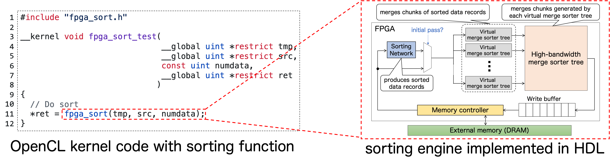

# FPGA Sort
**FPGA Sort** is a sorting library for FPGA implementation.
This has a hardware engine in RTL to perform the sorting process and call it a library from the OpenCL kernel code.
The engine is built by combining the following three hardware sorting algorithms: the sorting network, high-bandwidth merge sorter tree, and virtual merge sorter tree.


## License
This product is licensed under the [Apache License, Version 2.0](https://www.apache.org/licenses/LICENSE-2.0).

## How to use
1. `cd eval`
2. Prepare a Makefile like the following
```Makefile
# Compiler
NVCC := nvcc

# Compilation flags
NVCCFLAGS               := -O3 -arch=sm_70 -g -std=c++11 -Xcompiler -Wall -Xcompiler -Wextra -Xcompiler -fopenmp
NVCC_NONSUPPORTED_FLAGS := -Wl,--no-as-needed

# Target
TARGET := eval_fpga_sort.exe
AOCX   := intel_fpga_sort.aocx

# Files
SRCS := main.cu
LIBS := cuda rt

# Settings of the OpenCL kernel code compilation
CL_KERNEL              := intel_fpga_sort.cl
CL_XML                 := fpga_sort.xml
CL_OBJ                 := fpga_sort.aoco
CL_LIB                 := fpga_sort.aoclib
OFFLINE_COMPILER       := aoc
OFFLINE_COMPILER_FLAGS := -report -g -v
# if you use a10pl4_dd4gb_gx115_m512, change to -board=a10pl4_dd4gb_gx115_m512
TARGETED_FPGA_BOARD    := p520_max_sg280h

# Make it all!
all: Makefile $(SRCS) $(CL_KERNEL) $(AOCX) compile

compile:
	$(NVCC) $(NVCCFLAGS) -Xcompiler -fPIC $(shell aocl compile-config) -DCL_TARGET_OPENCL_VERSION=200 $(SRCS) $(filter-out $(NVCC_NONSUPPORTED_FLAGS),$(shell aocl link-config)) $(foreach L,$(LIBS),-l$L) -o $(TARGET)

$(AOCX):
	$(OFFLINE_COMPILER) -board=$(TARGETED_FPGA_BOARD) -c $(CL_XML) -o $(CL_OBJ)
	aocl library create -o $(CL_LIB) $(CL_OBJ)
	aoc -board=$(TARGETED_FPGA_BOARD) $(OFFLINE_COMPILER_FLAGS) -I./ -l$(CL_LIB) $(CL_KERNEL) -o $(AOCX)

run:
	env OMP_NUM_THREADS=14 numactl --cpunodebind=1 --localalloc ./$(TARGET) $(AOCX) 10

emulate:compile
	$(OFFLINE_COMPILER) -board=$(TARGETED_FPGA_BOARD) -c $(CL_XML) -o $(CL_OBJ)
	aocl library create -o $(CL_LIB) $(CL_OBJ)
	$(OFFLINE_COMPILER) -DUSE_EMULATOR -march=emulator -legacy-emulator -board=$(TARGETED_FPGA_BOARD) $(OFFLINE_COMPILER_FLAGS) -I./ -l$(CL_LIB) $(CL_KERNEL) -o $(AOCX)
	env CL_CONTEXT_EMULATOR_DEVICE_INTELFPGA=1 OMP_NUM_THREADS=14 numactl --cpunodebind=1 --localalloc ./$(TARGET) $(AOCX) 10

config:
	env ACL_PCIE_USE_JTAG_PROGRAMMING=1 aocl program acl0 $(AOCX)

.PHONY: clean
clean:
	rm -rf $(TARGET) $(CL_OBJ) $(CL_LIB) .emu_models intel_fpga_sort.aoco intel_fpga_sort.aocr reprogram_temp.sof

```
3. Compile the kernel code, host code, and run the application.

## Grants

Grants-in-Aid for Scientific Research-KAKENHI- "Early-Career Scientists" by Japan Society for the Promotion of Science.

URL: <https://kaken.nii.ac.jp/en/grant/KAKENHI-PROJECT-19K20276/>

## Publications

- Ryohei Kobayashi et al., [An Open-source FPGA Library for Data Sorting](https://doi.org/10.2197/ipsjjip.30.766), Journal of Information Processing, 2022
- Ryohei Kobayashi et al., [A Sorting Library for FPGA Implementation in OpenCL Programming](https://doi.org/10.1145/3468044.3468054), HEART '21
